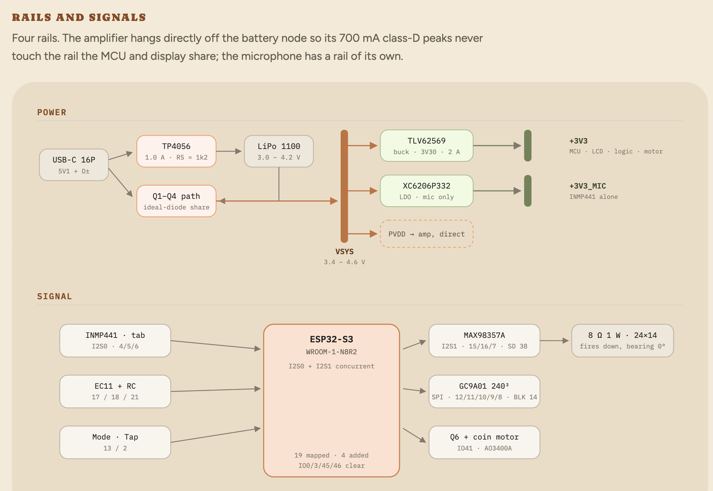
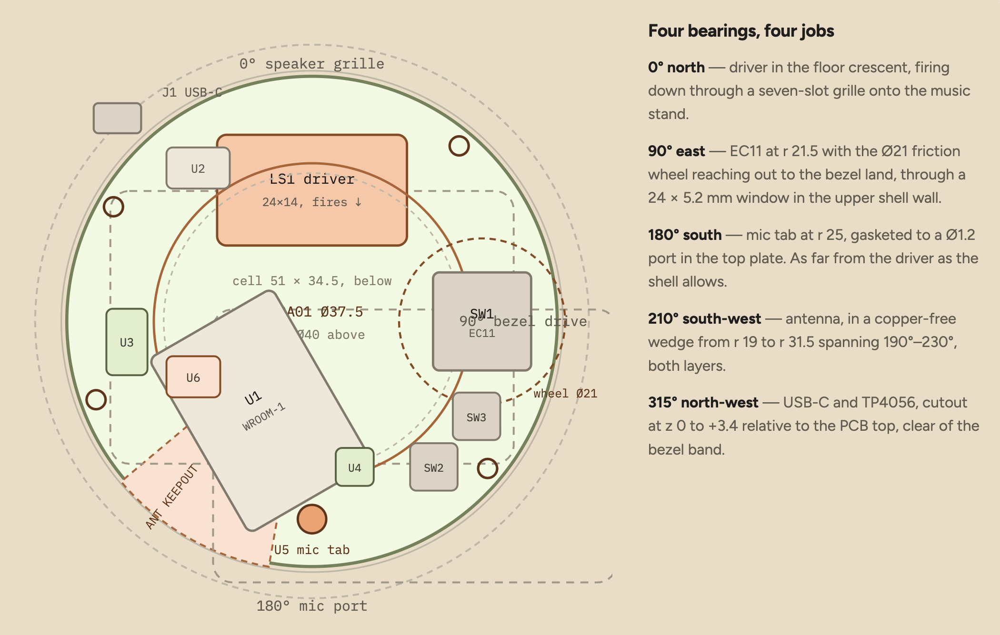
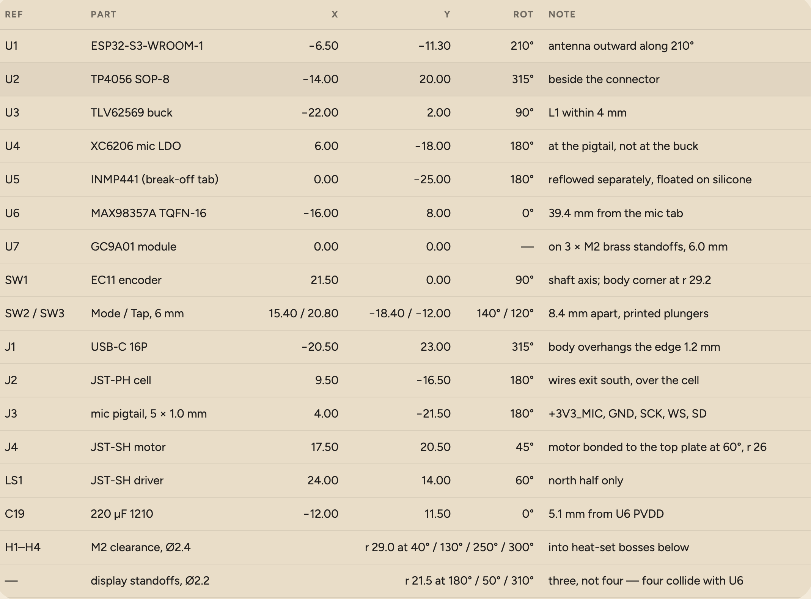
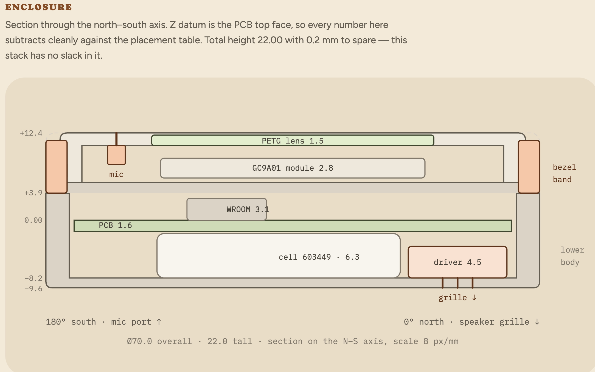
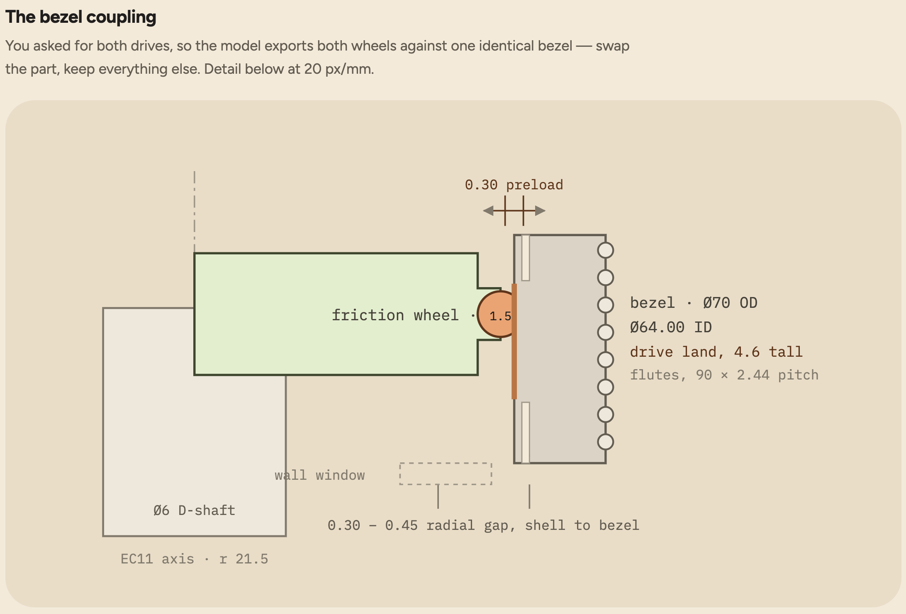
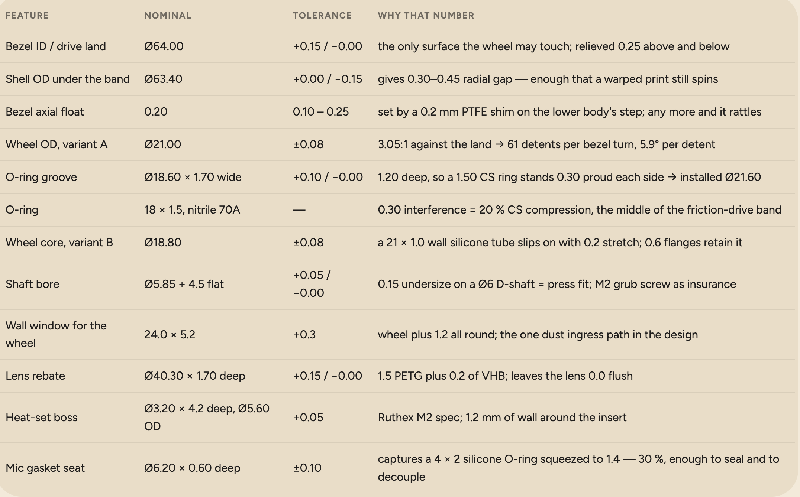

# SurSense

A small palm-sized device that listens to you when you play and it works out the scale and also gives you a drone of that scale to practice against.

Point it at an instrument and it names the tonic and the scale in both Western and Indian
notation — "C# Kafi / Dorian" — then plays a tanpura drone tuned to that tonic. It is also
a chromatic tuner and a metronome with taal cycles like teental, plus a silent haptic mode.

Every tuner tells you one note. Almost nothing tells you what key the whole piece is in,
and nothing does it with sargam and an attached drone.


## Status

The detection algorithm is written, builds, and is tested. The hardware is designed and specified but not yet built - this repo is the design and the working software that will run on it.

**Self-test: tonic 24/24.** Twelve synthesized scales per mode, one for each tonic, passed
through the detection pipeline and checked against the answer.

## Test it

```bash
cd sur && clang++ -std=c++17 -O2 -Wall -Wextra -o selftest sur.cpp selftest.cpp && ./selftest
```

Takes a few seconds. No special hardware, no libraries, no build system. Compiles clean
under `-Wall -Wextra`.

## How it works

1. FFT the input sound, detect peaks in its spectrum, with parabolic interpolation
   to ensure that the low tones fall on the correct semitones.
2. Map those peaks into 12 pitch classes, depending on the proximity of each peak
   to the center of a semitone. Summarize for a few seconds.
3. Compare the result with the Krumhansl-Schmuckler probe-tone profile for all 12
   rotations in order to determine the tonic pitch.
4. Resolve ambiguities of major-minor modality with a second accumulator,
   decaying more slowly: the tone class that remains active longest will be tonic.
5. Compare the rest of the spectrum with scale candidates.
6. Make the output decisions persistent with a locking state machine: lock
   easily but unlock reluctantly to avoid oscillations on the display screen.

Step 4 is the part that is not from a paper. C major and A minor contain identical notes,
so correlation alone cannot separate them. Measuring which pitch class is *sustained*
rather than merely present resolves it.

That claim is measurable, so here is the ablation. The self-test holds the tonic for 0.6s
and the other degrees for 0.3s, which is what the sustain bias exploits:

| Sustain bias | Note durations | Tonic |
|---|---|---|
| on (`kSustainBias = 0.18`) | as written | **24 / 24** |
| off | as written | 23 / 24 |
| on | equalised to 0.3s | 21 / 24 |
| off | equalised to 0.3s | **14 / 24** |

Equalising durations removes the cue the bias reads, and turning the bias off on top of
that costs another seven. So it carries real weight, not decoration — but the honest
version is 21→14, not a collapse.

## Honest Limits to this device

- The self-test is synthetic, and I wrote both the detector and the grader. It
  proves the implementation is correct, not that it survives real room audio.
- Short phrases are undecidable in principle. Five notes cannot distinguish
  Dorian from natural minor — the distinguishing degree was never played.
- Percussion adds broadband energy and will reduce accuracy.
- Nothing has run on hardware yet.

## HARDWARE

A 70mm puck will be used so basically a knurled metal bezel is the rotary encoder — the whole ring turns so you can set the tempo without looking while holding an instrument. It is kinda like my AC system which turns and you can set the temperature from it like that. 

BOM.csv is in sheets: https://docs.google.com/spreadsheets/d/1nKPMvtGOhtMLgeP8bByzdkwNMy8-5KtI2vqGwreh8vg/edit?usp=sharing

**Total: $154.26 USD**, converted from live Amazon.ca listings at 1 CAD = 0.72 USD. Every
link was checked in stock on 14 Aug 2026.

**One ESP32-S3, not three.** The old BOM linked a 3-pack listing, so clicking through
suggested the build needed three processors. It needs one. Several other parts are sold
only in multipacks, so the BOM now lists pack size and board count in separate columns and
prices each line at what checkout actually charges.

Pin assignments are in `HARDWARE.md`. The microphone and amplifier are on
separate I2S peripherals — the S3 has two, and this needs both. Total GPIO used: 19 of 36.

## Design

### Power and signal



Four rails. The class-D amplifier hangs directly off the battery node so its 700mA peaks
never touch the rail the MCU and display share, and the microphone gets an LDO of its own.
One ESP32-S3-WROOM-1-N8R2 carries everything, with both I2S peripherals running
concurrently so the mic can capture while the amp drives the drone.

USB-C feeds a TP4056 and an ideal-diode load-share path (Q1–Q4) in parallel, so the device
runs while charging without the charger's termination logic being confused by the load.

### PCB placement




Round 2-layer board, Ø70. Four bearings do four jobs: the speaker fires down at 0°, the
bezel drive sits at 90°, the mic port is at 180° — as far from the driver as the shell
allows — and the WROOM-1 antenna gets a copper-free wedge at 210°.

### Enclosure



Z datum is the PCB top face. The stack closes at 22.00mm with 0.2mm to spare, so there is
no slack in it.

### Bezel coupling




The knurled bezel is the encoder. Two drive variants export against one identical bezel so
both can be printed and compared: **A** is an 18 × 1.5 nitrile O-ring at 20% compression,
**B** is a silicone tube sleeve. A printed spur gear was considered and rejected — it is
audible, and the microphone is listening 30mm away while you turn it.

At Ø21.00 against the Ø64.00 drive land, one bezel turn is 61 encoder detents, 5.9° each.

### Still to draw

- [ ] `hardware/` — KiCad schematic and 2-layer layout, from the placement table above
- [ ] `cad/` — CadQuery script exporting STEP, from the section and tolerance tables

## Known possible risks

- **Feedback.** Mic and speaker are 70mm apart. If the drone plays while detection runs,
  the device may hear itself and lock onto its own output. Handled by mode exclusivity
  plus notching the known drone pitches.
- **Bezel coupling.** Driving an EC11 from a printed knurled ring is the most
  likely thing to feel rough in v1. Budget three revisions.
- **First PCB.** Even odds it needs a respin, which is why it gets ordered the
  day the breadboard prototype works.

## Documents

- `HARDWARE.md` — parts, pin map, form factor, build schedule
- `FIRMWARE.md` — toolchain, firmware architecture, feature roadmap
- `BOM.csv` — bill of materials, USD
- `sur/` — the detector and its self-test
- `docs/` — design diagrams

The written documents were drafted with the help of Claude AI. The detection algorithm,
its self-test and the hardware design are mine.

**OVERALL THIS WILL REALLY HELP MUSICIANS AND I HOPE I GET THE PARTS SO I CAN MAKE IT INTO A REAL PRODUCT**